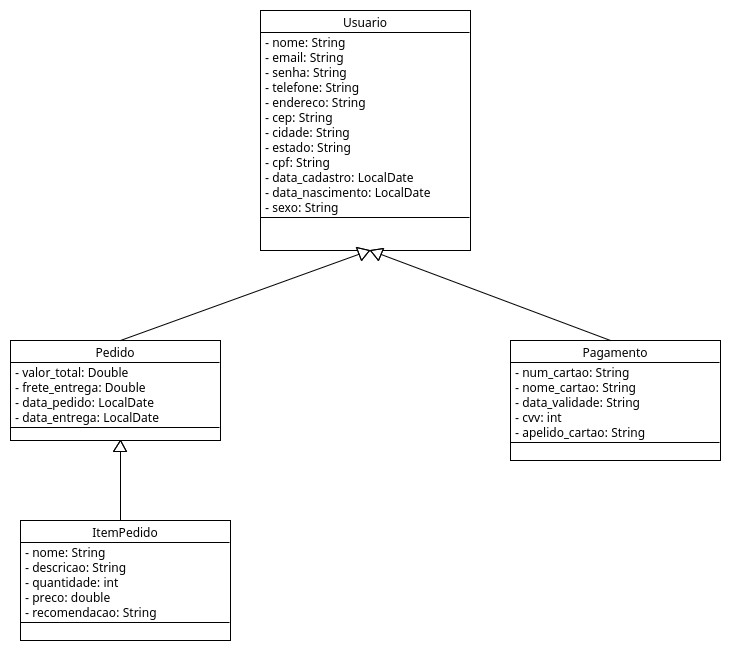
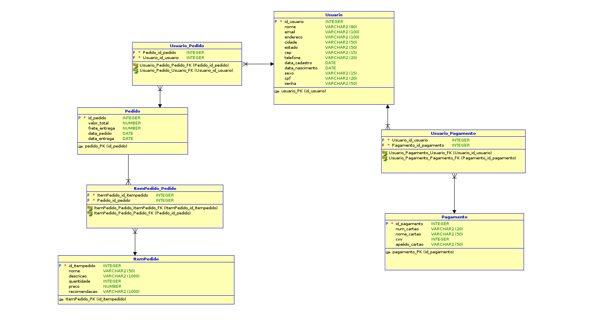

# OrderAI

## Nome da aplicação;

OrderAI

## Nome completo e breve apresentação dos integrantes do Grupo (Atividade da qual ficou responsável no projeto);

Gabriel Augusto Fernandes - RM98986 (DISRUPTIVE ARCHITECTURES: IOT, IOB & GENERATIVE IA | COMPLIANCE, QUALITY ASSURANCE & TESTS)

Kauê Fernandes Braz - RM97768 (ADVANCED BUSINESS DEVELOPMENT WITH .NET | JAVA ADVANCED)

Mariana Trentino Albano - RM551154 (MASTERING RELATIONAL AND NON-RELATIONAL DATABASE)

Matheus Dantas de Sousa - RM98406 (DevOps Tools & Cloud Computing)

Thomas Nícolas de Melo Mendonça - RM99832 (Mobile Application Development)

## Instrução de como rodar a aplicação;

1. Baixar o extension pack do JAVA
2. Ir até o orderAI/src/main/java/com/example/orderAI/OrderAiApplication.java
3. Clicar em Run para rodar a API
4. Pesquisar por localhost:8080
5. Acessar o h2-console para verificar a persistência de dados através da url localhost:8080/h2-console
6. trocar o JDBC URL por jdbc:h2:mem:orderai e conectar
7. Testar as requisições pelo Postman ou Insomnia

## Cronograma de Desenvolvimento

[Cronograma de Atividades](./Documentos/cronograma-atividades.pdf)

## Imagem dos diagramas;

### Diagrama UML

### Modelagem Banco de dados

## Link para vídeo apresentando a Proposta Tecnológica, o público-alvo da aplicação e os problemas que a aplicação se propõe a solucionar;

[Vídeo Solução OrderAI](https://youtu.be/sG_JNFG8ArU)

### Testar requisições no Postman

[JSON da Collection do Postman](./Documentos/OrderAI.postman_collection.json)